# AnnoyingHeroGame([불편 용사 ;; 세상 사람들이 불편(不便)해하는 행동은 다 해서 주변의 빈축(嚬蹙)만 샀던 내가 이세계(異世界)에서는 프로 불편 용사(勇者)라고?])
make 2D game with unity


<div align="center">
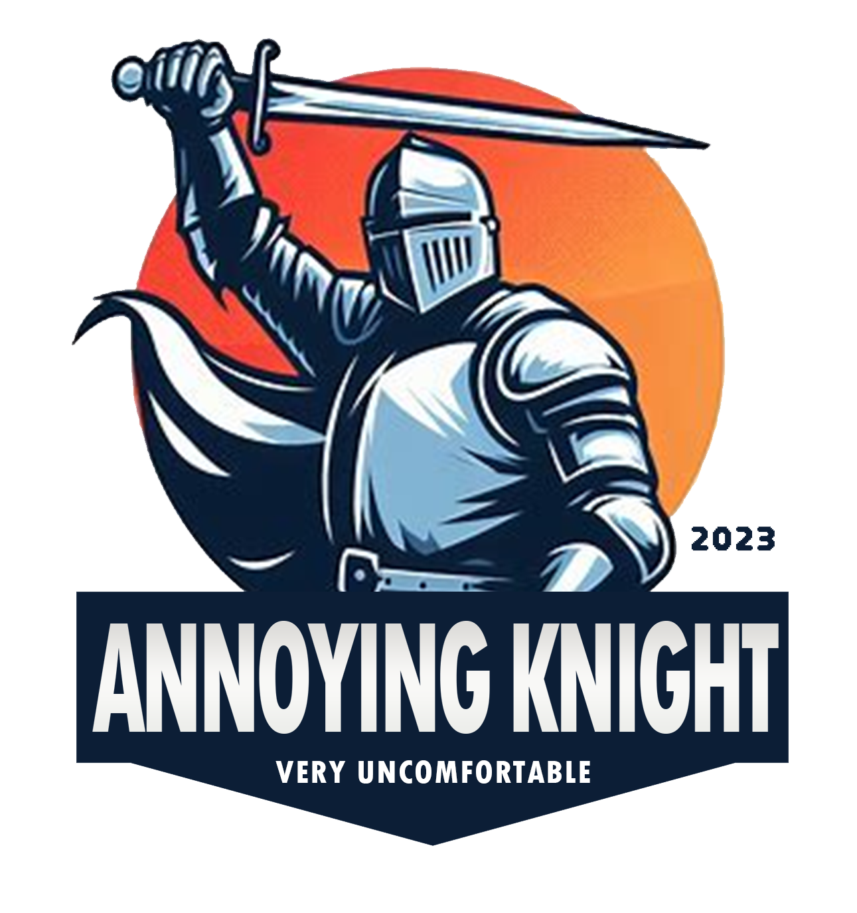
</div>

## UCC, PPT, 기획

[UCC PPT[불편 용사 ;; **세상 사람들이 불편(不便)해하는 행동은 다 해서 주변의 빈축(嚬蹙)만 샀던 내가 이세계(異世界)에서는 프로 불편 용사(勇者)라고?**]](https://www.notion.so/UCC-PPT-7ba524f8a1424cc693102a2883c23197?pvs=21)

[시나리오 스크립트](https://www.notion.so/6c2daa407e6c4e8aa726f6dd892fbec1?pvs=21)

[보스 공격 패턴 기획하기](https://www.notion.so/f3267279480c499d90f567279964e670?pvs=21)

# 🦸🏻🦹🏻‍♀️ 프로젝트 컨셉

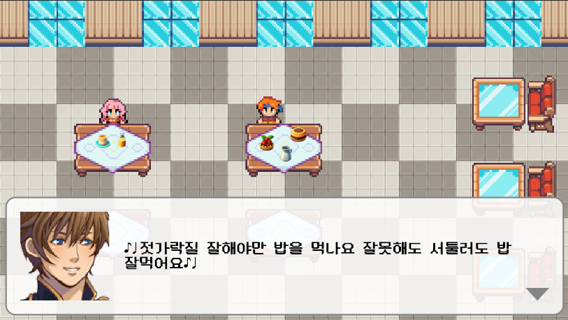


> “**세상 사람들이 불편해 하는 행동은 다 해서 주변의 빈축(**嚬蹙)**만 샀던 내가 
이 세계에서는 프로 불편 용사라고?”**
> 
> 
> 완벽 마왕들이 완벽하지 않은 사람들을 모두 잡아내고 쓰러뜨려 세상을 지배했다.
> 
> 잡혀가지 않고 남은 사람들은 행동 하나하나를 조심해야 살아남을 수 있게 됐다.
> 
> 그런 세상에 떨어진 `**다리 떨고 쩝쩝 대고 맞춤법 틀리고 면 치기 하는 주인공**`.
> 

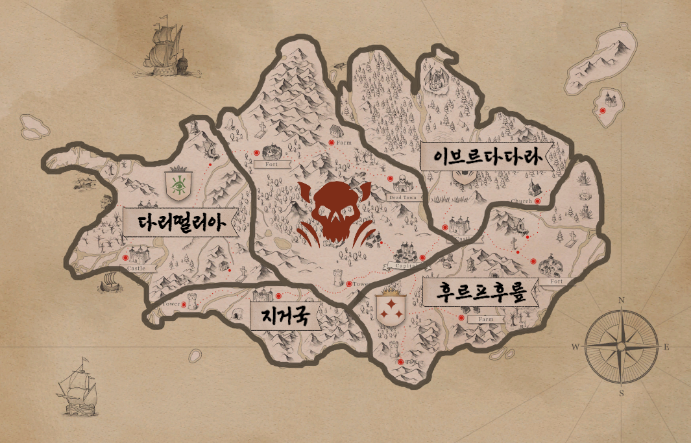

> 마왕과 그의 부하들을 쓰러뜨려 세상을 자유롭게 만들어야 하는 운명의 소용돌이 속으로..!!
> 

# 시나리오

## 🔌 닉네임 입력으로 게임 접속

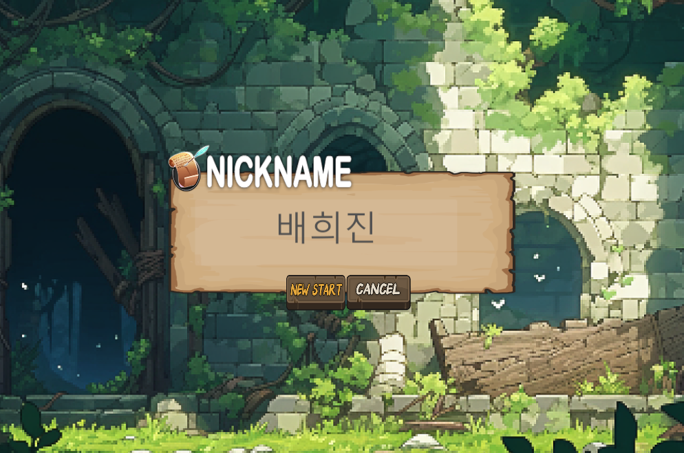


> 개성 있는 닉네임으로 게임을 시작해요
> 

---

## 🏹 첫 번째 게임 `이브르다다라`

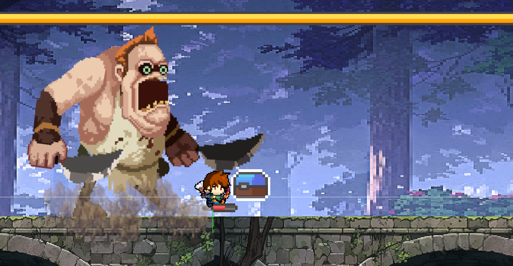

> 조용히 음식을 먹어야 하는 `랭KING` 이 점령한 이브다다라 성!
> 

```
# 설명서
뛰어난 미식가 겸 요리사인 랭KING의 공격을 피하며 보스를 처치해야하는 보스전 게임입니다.
아이템 상자에서 나오는 아이템(스피커, 음식, 총알, 하트 등)을 이용하여 용사의 공격력을 올리고 아이템을 장착하여 보다 쉽게 랭KING을 처치할 수 있을거에요

점프(SPACE)와 방향키(위 방향키, 오른쪽 방향키)을 통해 보스의 공격을 피해보세요
쩝쩝 공격(LeftCtrl)을 통해 쩝쩝 소리를 내며 공격을 해보세요
	공격은 보스와 아이템 상자 중 가까운 곳으로 발사가 되니 랭KING과의 거리를 잘 생각하시면서 게임을 플레이하셔야합니다.
방어(아래쪽 방향키)를 통해 무자비하게 공격해오는 보스의 공격을 막아보세요
```

### 지도 & Entry Map

<div style="display: flex;">
  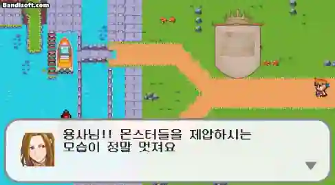
  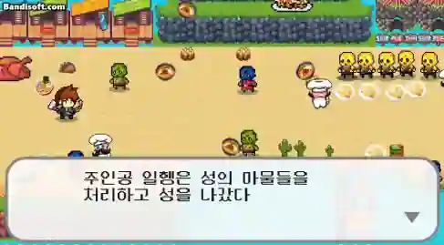
</div>	


```python
- 카메라 애니메이션을 이용하여 script를 읽으면서 몰입감을 증진시켰습니다.
- map에서도 캐릭터들의 애니메이션으로 생동감을 구현하였습니다.
```

### 시작 & esc

<div style="display: flex;">
  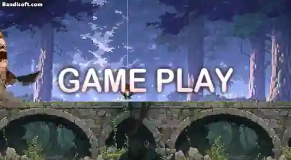
  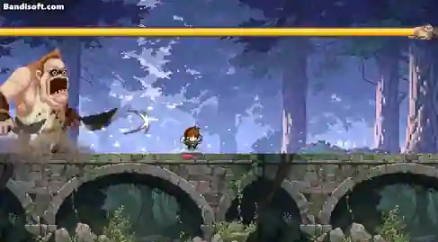
</div>	


```python
- 보스맵은 무한 맵을 구현하여 승리 혹은 패배까지 꾸준히 달릴 수 있게 만들었습니다.
- ESC를 클릭하시면 게임에서 나갈 수도 있고 게임 선택창으로도 나갈 수 있습니다.
- ESC를 클릭하시면 게임에 필요한 설명서가 왼쪽에 보입니다.
```

### Item

<div style="display: flex;">
  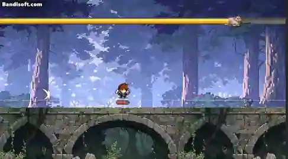
  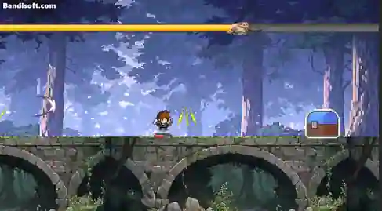
</div>

<div style="display: flex;">
  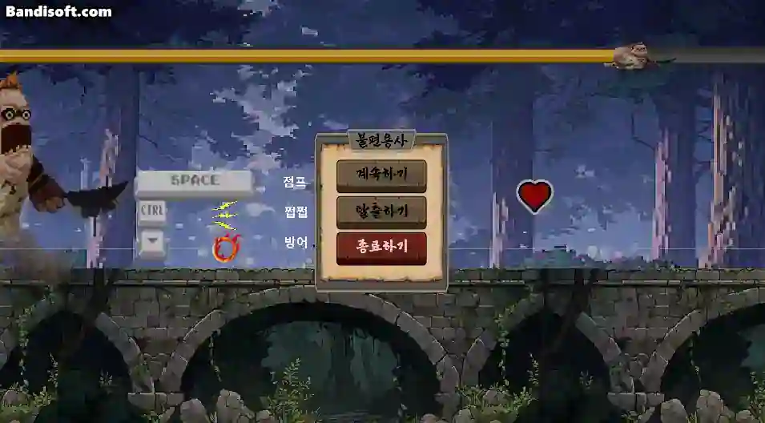
  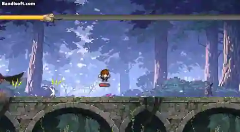
</div>


```python
- Item은 5가지 종류를 가지고 있으며 확률에 따른 random 방식으로 구현됩니다.
```

### Play

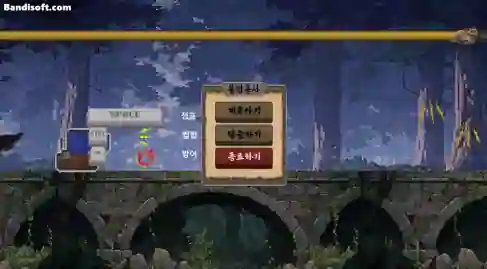

```python
- 즐겁게 게임을 즐길 수 있습니다.
```

### Win & Fail

<div style="display: flex;">
  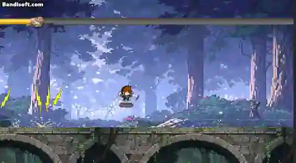
  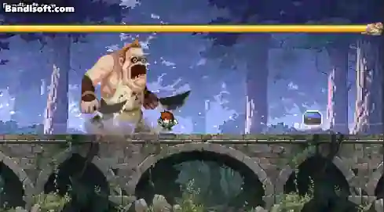
</div>


```python
- 승리와 패배의 ui를 달리하여 게임을 새롭게 플레이하거나
- 다음 게임으로 넘어갈 수 있습니다.
```

---

## 🕊️ 두 번째 게임 `지거국`

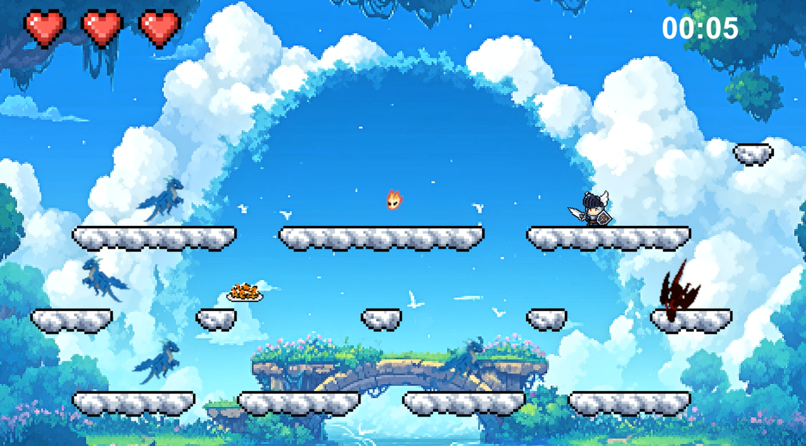

> 탕수육은 무조건 부어 먹는 `부머기라스` 가 점령한 지거국!
> 


---

## 👟 세 번째 게임 `후르프후릎`


> **면치기**를 가장 더러워하는 `후르브킹` 이 점령한 후르프후릎 성!
> 
> 
> `후르브킹`을 이기기 위해서는 면치기를 하며 온 방안을 돌아다녀야 한다!
> 
> 그렇게 튄 라면 국물로 모든 방이 더러워지면 `후르브킹`과 대면할 수 있게 되는데…
> 

### 설명서

```
**# 설명서**

1. 라면을 먹으면서 면발을 끊지 않고 달려갑니다.
2. 길 중간에 등장하는 가위는 점프를 통해 피합니다.
3. 면을 달고, 온 방안을 휘저어 다니면 끝납니다!

- 점프키는 [SPACE] 입니다.
- 중간에 나오는 어묵은 생명이 됩니다.
  [끝까지 남은 어묵 X 10]가 점수가 됩니다.
- 보스전 후, 남아있는 어묵은 점수가 됩니다.
- 점프키를 길게 누르면 조금 더 높게 뜁니다.
```

---

## 🥁 네 번째 게임 `다리떨리아`

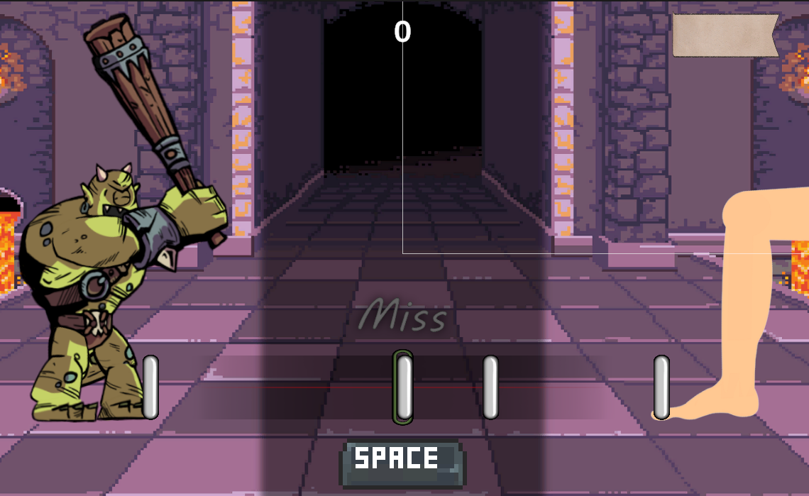


> 다리 떠는 것을 혐오하는 `고만터러킹` 이 점령한 다리떨리아 성!
> 

### 점수 로직

- Perfect : 10점
- Cool : 7점
- Good : 4점
- Bad : -3점
- Miss : -6점
- Bad/Miss 시 콤보 초기화
- 10콤보당 3점씩 추가로 획득
- 최종 획득 점수 = (미니게임 점수) / 3000

---

## 🍽️ 마지막 게임 `보스전`

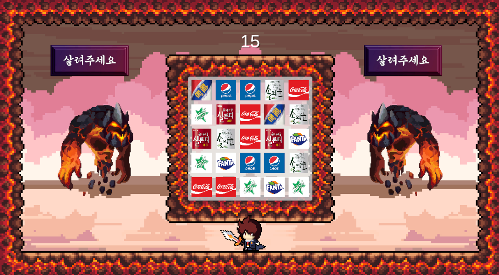

> 가장 강력하고 결벽적인 `파르펙토(perfect)` 대마왕!
그런 대마왕에게 단 한 가지 결점이 있었다?
비대칭 `괴식 콘텐츠`로 마왕의 홧병을 유도하여 이세계를 구해줘!
> 

```
# 설명서
마왕의 심기를 건드려서 파르펙토 마왕이 열받도록 도와주세요!

1. 마왕이 제시하는 사진의 빈칸에 들어갈 콘텐츠를 3 Match Puzzle에서 부숴주세요.
2. 단, 마왕을 불편하게 만들기 위해서는, 괴식 콘텐츠를 골라야 합니다.
3. 괴식이 아닌 콘텐츠는 점수 합산이 되지 않습니다.
4. 100점이 넘을 때마다 스페이스바를 연타하여 마왕에게 홧병 에네르기파를 쏘세요.
```

## 🥇 랭킹 확인

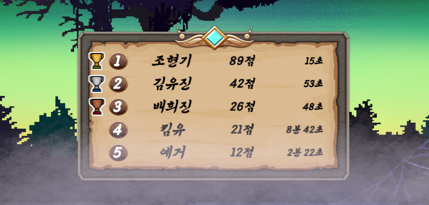

# 기술 스택

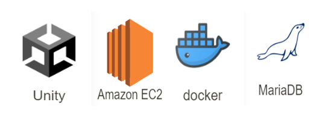

# 팀원 소개

### 👤 Game

류정모 <이브르다다라>

엄한결 <지거국>

김유진 <후르프후릎>

조현기 <다리떨리아>

배희진 <보스전>

### ⚙️ Database

임혜지 : 닉네임 입력, 플레이 타임, 랭킹
